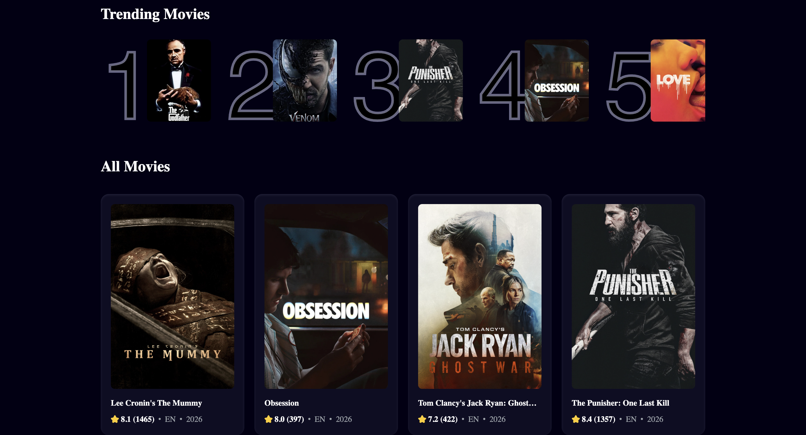

# Movie App

**[Live Demo →](https://movie-app-three-olive-66.vercel.app)**

A full-stack movie discovery app built with React and Vite. Search through thousands of movies powered by the TMDB API, with a trending section that tracks the most-searched movies in real time via Supabase.




## Features

- Browse popular movies on load, sorted by popularity
- Debounced live search across the TMDB catalog
- Trending section — top 5 most-searched movies tracked in Supabase
- Movie cards with rating, language, and release year

## Tech Stack

- **React 19** + **Vite**
- **Tailwind CSS v4**
- **TMDB API** — movie data and posters
- **Supabase** — tracks search counts and powers the trending section

## Getting Started

### 1. Clone the repo

```bash
git clone https://github.com/ahmedabubakr92/movie_app.git
cd movie_app
```

### 2. Install dependencies

```bash
npm install
```

### 3. Set up environment variables

Copy `.env.example` to `.env` and fill in your keys:

```bash
cp .env.example .env
```

| Variable | Where to get it |
|---|---|
| `VITE_TMDB_API_KEY` | [TMDB API settings](https://www.themoviedb.org/settings/api) — use the **Bearer token** |
| `VITE_SUPABASE_URL` | Your Supabase project URL |
| `VITE_SUPABASE_ANON_KEY` | Your Supabase project's anon/public key |

### 4. Run locally

```bash
npm run dev
```

## Supabase Setup

Create a table called `metrics` with these columns:

| Column | Type |
|---|---|
| `id` | `int8` (primary key, auto-increment) |
| `search_term` | `text` |
| `movie_id` | `int8` |
| `title` | `text` |
| `poster_url` | `text` |
| `count` | `int8` |

## Deploying to Vercel

1. Import this repo on [vercel.com](https://vercel.com)
2. Add the three environment variables from your `.env`
3. Deploy — Vite is auto-detected, no extra config needed
